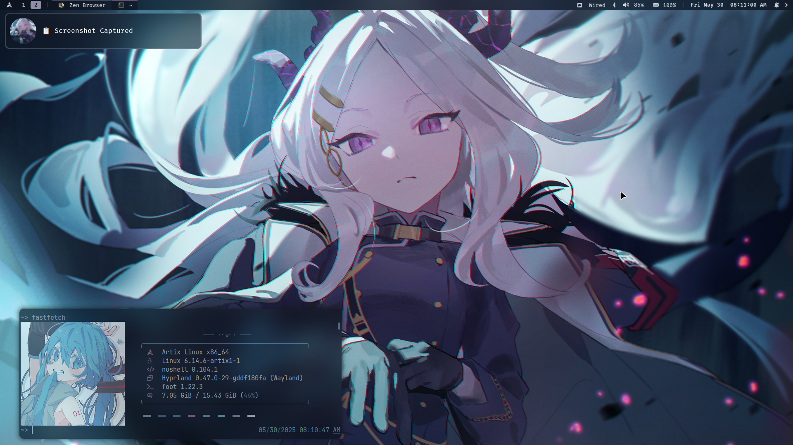

## Hyprfiles

My dotfiles for Hyprland, with left-hand centered keybinds/submaps

## System Information:
* OS: [Artix GNU/Linux](https://artixlinux.org/)
* Terminal Emulator: [foot](https://wiki.archlinux.org/title/Foot)
* Window Manager: [Hyprland](https://hyprland.org/) w/ [waybar](https://man.archlinux.org/man/waybar.5.en)
* Launcher: [wofi](https://man.archlinux.org/man/wofi.1)
* Notification Manager: [SwayNC](https://github.com/ErikReider/SwayNotificationCenter)
* Clipboard Manager: [Clipse](https://github.com/savedra1/clipse)
## How it will look:

[See Hyprlock](Github/20250302_10h53m52s_grim.png)

## Dependencies for Arch-based distros:
'$ pacman -Sy Hyprland hyprlock hypridle swaybg foot wofi swaync wlogout waybar ttf-fira-code ttf-nerd-fonts-symbols noto-fonts-emoji pywal'
