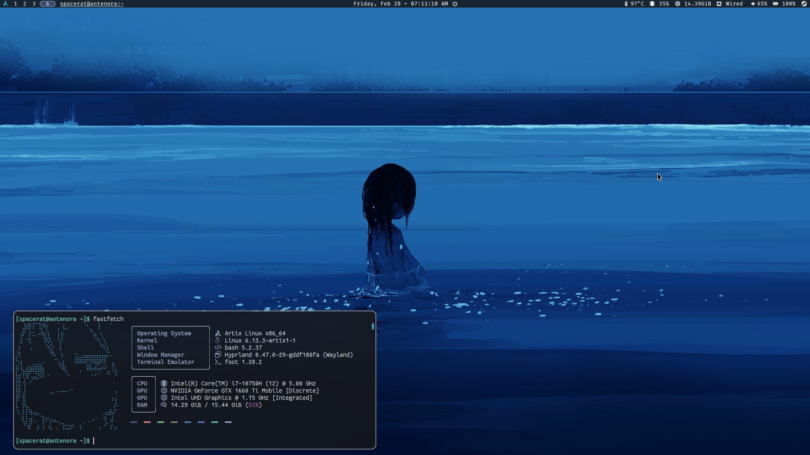

## Hyprfiles

My dotfiles for Hyprland, with sway/i3 keybinds and left-hand centered submaps

## System Information:
* OS: [Artix GNU/Linux](https://artixlinux.org/)
* Terminal Emulator: [foot](https://wiki.archlinux.org/title/Foot)
* Window Manager: [Hyprland](https://hyprland.org/) w/ [waybar](https://man.archlinux.org/man/waybar.5.en)
* Launcher: [wofi](https://man.archlinux.org/man/wofi.1)
* Notification Manager: [SwayNC](https://github.com/ErikReider/SwayNotificationCenter)
## How it will look:

[See Hyprlock](Github/20250302_10h53m49s_grim.png)

[See colorscheme](Github/20250228_07h11m46s_grim.png)

[See wofi](Github/20250228_07h11m24s_grim.png)
## Dependencies for Artix:
'$ pacman -Sy Hyprland hyprlock hypridle swww swaync foot wofi dunst wlogout power-profiles-daemon waybar ttf-fantasque-sans-mono ttf-fira-code ttf-nerd-fonts-symbols noto-fonts-emoji'
