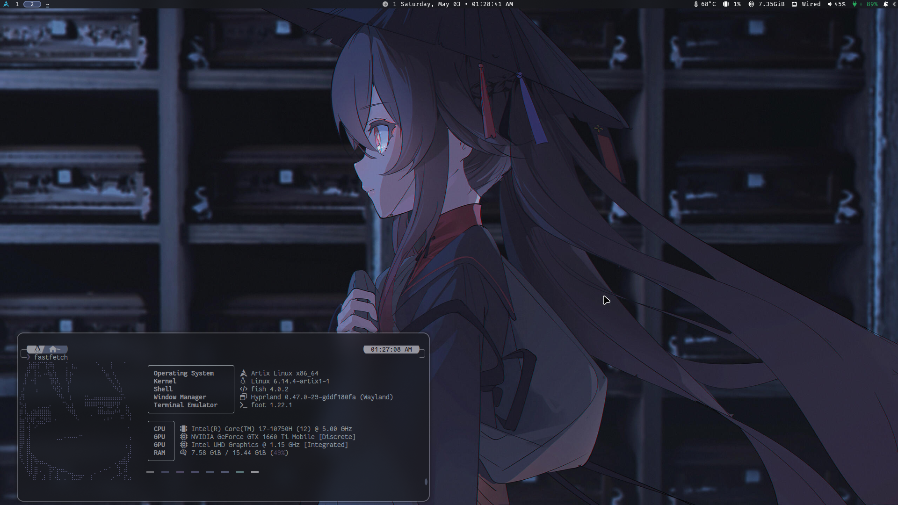

#  Hyprfiles

 • 

My dotfiles for Hyprland, with left-hand centered keybinds/submaps

##
[See Hyprlock in gallery](Github/2.png)

## System Information:
* OS: [Arch GNU/Linux](https://archlinux.org/)
* Terminal Emulator: [kitty](https://github.com/kovidgoyal/kitty)
* Window Manager: [Hyprland](https://hyprland.org/)
* Bar: [waybar](https://man.archlinux.org/man/waybar.5.en)
* Launcher: [wofi](https://man.archlinux.org/man/wofi.1)
* Notification Manager: [SwayNC](https://github.com/ErikReider/SwayNotificationCenter)
* Clipboard Manager: [Clipse](https://github.com/savedra1/clipse)
* Cursor: [Bibata Modern Classic](https://github.com/ful1e5/Bibata_Cursor/releases)
* Wallpaper tool  &  Color generation: [swaybg](https://github.com/swaywm/swaybg) or [mpvpaper](https://github.com/GhostNaN/mpvpaper), [pywal16](https://github.com/eylles/pywal16) w/ [wrapper scripts](https://github.com/fleshguard/hyprfiles/blob/main/Scripts/)
* Battery life optimization using asusctl: ['powermode' wrapper](Scripts/Hyprland/powermode.sh)

## 

> [!NOTE] 
> These are my personal dots—theyre not perfect, so you might have to edit some configs or scripts
>
> But everything else you need should be named or in 'System Information'

