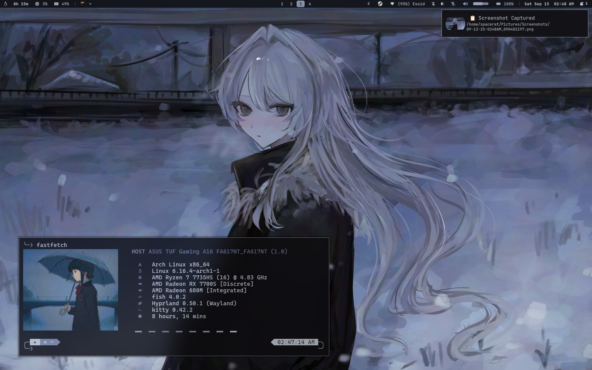

#  ⚙️ Hyprfiles

  • 

My dotfiles for Hyprland, with left-hand centered keybinds/submaps

##
[See Gallery](Github/) • [See Wallpapers](https://drive.proton.me/urls/RZQ5D3Q5S4#BKeL9QLuCTG5)

> [!NOTE] 
> These are my personal dotfiles, they are not perfect, or complete. You may have to edit some things. 
> Everything else you need should be named or in 'System Information'

## System Information:
*  OS: [Arch GNU/Linux](https://archlinux.org/)
*  Terminal Emulator: [kitty](https://github.com/kovidgoyal/kitty)
*  Window Manager: [Hyprland](https://hyprland.org/)
*  Bar: [waybar](https://man.archlinux.org/man/waybar.5.en)
*  Launcher: [wofi](https://man.archlinux.org/man/wofi.1)
*  Notification Manager: [SwayNC](https://github.com/ErikReider/SwayNotificationCenter)
*  Clipboard Manager: [Clipse](https://github.com/savedra1/clipse)
*  Cursor: [Bibata Modern Classic](https://github.com/ful1e5/Bibata_Cursor/releases)
